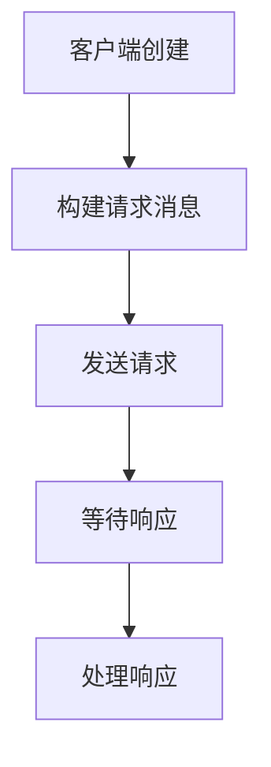
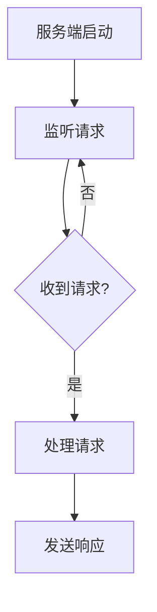
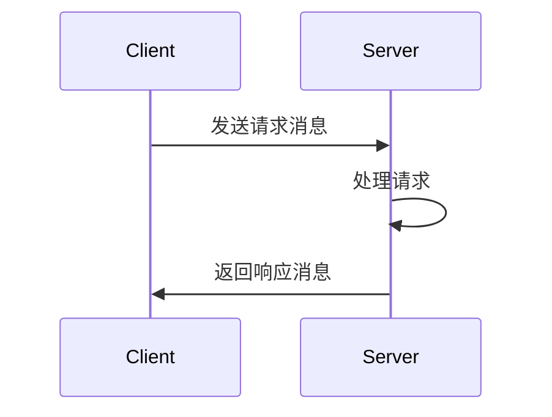

# es_lrpc - 基于libipc的RPC通信框架

## 概述
es_lrpc是一个基于libipc实现的问答模式RPC通信框架，提供简单的客户端-服务端通信机制。

## 主要特性
- 基于模板的消息序列化
- 自动消息路由
- 异步请求/响应处理
- 线程安全设计

## 构建与安装

### 依赖
- CMake 3.10+
- libipc库

### 构建步骤
```bash
mkdir build && cd build
cmake ..
make
```

### 安装
```bash
make install
```

## API参考

### 消息定义 (message.h)
```cpp
template<typename T>
class message {
    uint64_t client_id;  // 客户端ID
    uint64_t message_id; // 消息ID
    T data;              // 消息数据
    
    // 构造函数和方法...
};
```

### 客户端 (client.h)
```cpp
template <typename Request, typename Response>
class client {
public:
    client();  // 构造函数
    
    // 发送请求
    bool send_request(const Request &request);
    
    // 接收响应
    bool recv_response(std::function<void(const Response &)> handler);
    
    // 设置响应处理器
    void set_response_handler(std::function<void(const Response &)> handler);
};
```

### 服务端 (server.h)
```cpp
template <typename Request, typename Response>
class server {
public:
    server();  // 构造函数
    
    // 接收请求
    bool recv_request(std::function<void(const RequestMessage &)> handler);
    
    // 发送响应
    bool send_response(const RequestMessage &request, const Response &response);
    
    // 设置请求处理器
    void set_request_handler(std::function<void(const RequestMessage &)> handler);
};
```

## 使用示例

### 定义消息类型
```cpp
// 参见examples/messages.h
class People {
    // 成员和方法...
};

class PeopleRequest {
    // 成员和方法...
};

class PeopleResponse {
    // 成员和方法...
};
```

### 客户端示例
```cpp
es_lrpc::client<PeopleRequest, PeopleResponse> client;
PeopleRequest request(0, People("John", 20, 1));

client.send_request(request);
client.recv_response([](const PeopleResponse& resp) {
    // 处理响应...
});
```

### 服务端示例
```cpp
es_lrpc::server<PeopleRequest, PeopleResponse> server;

server.recv_request([&](const auto& request) {
    PeopleResponse response(0, "OK", request.data.m_people);
    server.send_response(request, response);
});
```

## 注意事项
1. 消息类型必须是POD(Plain Old Data)类型
2. 客户端和服务端需要使用相同的消息类型定义
3. 默认使用系统时钟生成消息ID
4. 需要确保libipc环境配置正确

## 性能建议
- 避免在消息处理中进行耗时操作
- 对于高频通信，考虑使用线程池处理请求
- 合理设置消息超时时间

# 关键流程图：

## 1. 客户端请求流程：


## 2. 服务端处理流程：


## 3. 完整RPC交互流程：

